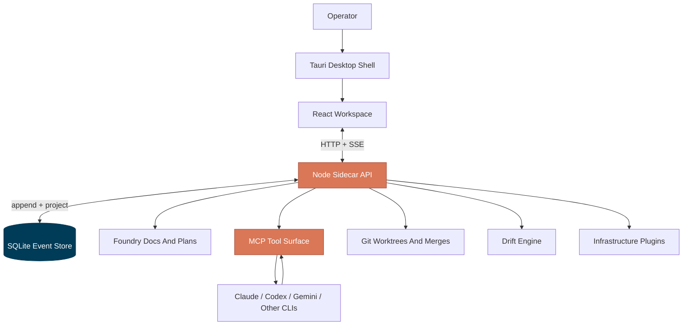

<div align="center">


# Symphony AI

**A local AI software foundry for turning ideas into specs, teams, tasks, code, and reviewed changes.**

Symphony combines a project-planning Foundry, real coding-agent teams, a local IDE, drift monitoring, risk gates, git worktrees, and infrastructure plugins into one desktop workspace. It is built for developers who want AI help without giving up project control, auditability, or local ownership.

[](https://nodejs.org/)
[](https://tauri.app/)
[](https://sqlite.org/)
[](https://modelcontextprotocol.io/)
[]()
[]()

<br/>


<sub><i>Workspace view with a Symphony agent team in flight. Run <code>npm run screenshots</code> from <code>toad-local</code> to regenerate screenshots from the local app.</i></sub>

</div>

---

## The Short Version

Symphony AI started as a small agent-team prototype. It has grown into a local software foundry:

- **Foundry** helps you shape a project through a chat-driven planning loop and turns that discussion into product briefs, technical specs, roadmaps, schemas, and task breakdowns.
- **Agent teams** launch real coding agents such as Claude, Codex, and Gemini into role-based workflows with durable tasks, reviews, validations, and audit logs.
- **The IDE surface** lets a human browse, edit, save, and review project files from inside the same workspace the team uses.
- **Drift monitoring** compares what the team is doing against task scope, lifecycle rules, tests, reviews, and project expectations.
- **Risk gates** keep sensitive files, destructive commands, and merge operations under explicit policy and human approval.
- **Infrastructure plugins** let agents work with services such as Railway, EAS, Vercel, and related deployment surfaces through the same audited tool layer.

The important distinction: Symphony is not just a chat box and not just a process launcher. It is a local operating layer for planning software, assigning work, watching agents act, and deciding what lands.

---

## What Symphony Does

<table>
<tr>
<td width="50%" valign="top">

### Foundry

Foundry is the planning front door. You chat through the idea, constraints, data model, architecture, product decisions, roadmap, and acceptance criteria. Symphony then materializes real project documents and starter tasks that an agent team can use.


</td>
<td width="50%" valign="top">

### Agent Teams

Create a lead plus specialist teammates, assign providers and roles, and let the team work through a structured task lifecycle. Agents communicate through Symphony's MCP tools, not through hidden side channels.


</td>
</tr>
<tr>
<td width="50%" valign="top">

### Tasks, Reviews, And Approvals

Tasks move through a deterministic lifecycle: backlog, ready, planned, in progress, review, testing, merge ready, done. Reviews capture real git diffs, validations capture real command output, and high-risk work can require human approval before merge.


</td>
<td width="50%" valign="top">

### Drift Monitor

The drift monitor scores whether work is staying aligned: invalid transitions, out-of-scope files, missing tests, role violations, rubber-stamped reviews, provider leakage, semantic drift, and done-without-merge evidence.


</td>
</tr>
<tr>
<td width="50%" valign="top">

### Local IDE

Browse a project, switch repositories, inspect task worktrees, edit files, and save through the orchestrator. The IDE is tied to the same project state, drift findings, task worktrees, and agent activity.

</td>
<td width="50%" valign="top">

### Provider And Plan Awareness

Symphony tracks provider auth and plan state where possible, including subscription-style CLI auth. The goal is to make model assignment and team launch decisions with visible context instead of guesswork.


</td>
</tr>
</table>

---

## Why This Exists

AI coding tools are powerful, but serious projects need more than prompts:

- A durable project memory.
- Clear specs before code starts.
- Real task ownership.
- Real git diffs, not agent-reported summaries.
- Review and validation gates.
- Human approval for risky operations.
- Local control over code, settings, logs, and secrets.
- Visibility when an agent drifts from the plan.

Symphony treats agents like teammates in a controlled local workspace. They can work, but their work is structured, observable, and reversible.

---

## Architecture

<div align="center">



</div>

SQLite at `<project>/.toad/toad.db` is the durable source of truth. The desktop shell, React UI, sidecar API, CLI agents, MCP server, and plugin tools are adapters around that evented core.

Agents call Symphony MCP tools such as `task_comment`, `validation_run`, `review_request`, `task_human_approve`, and `drift_run`. Those tools dispatch through [`LocalToolFacade`](toad-local/src/tools/localToolFacade.js), the same enforcement layer used by the UI's HTTP API. That gives Symphony one place for idempotency, role authority, task gates, risk policy, and audit logging.

---

## Core Capabilities

### Foundry To Team Launch

Foundry can turn project discovery into repository files and project artifacts:

- Product brief.
- Technical specification.
- Roadmap.
- Task breakdown.
- Prisma schema draft.
- Starter task set.
- Suggested team shape.

Those outputs can seed a real team so the lead agent starts with context instead of improvising.

### Agent Runtime Control

Symphony launches and supervises local CLI processes, records their runtime events, links runtime instances to tasks, and streams activity back to the UI. Runtime output is not treated as truth by itself; durable tool calls and task events are.

### Git Work And Merge Safety

Each task can receive an isolated git worktree. Reviews compute real diffs from `baseRef..HEAD`, scope drift is detected against allowed files, validations are recorded as task evidence, and merge gates run through non-destructive git checks before a task can land.

### Drift And Correction

The drift engine builds snapshots from task, runtime, review, and validation state. It runs deterministic checks plus an optional LLM semantic tier, then lets humans create correction tasks from selected findings.

### Infrastructure Plugins

The plugin system gives agents controlled access to external infrastructure through explicit tool definitions, auth helpers, resource tracking, job logs, and secret redaction. Railway, EAS, and Vercel work is being built through this layer.

---

## Quickstart

```bash
# 1. Clone
git clone https://github.com/TheOverAchievingDev/T.O.A.D.git symphony-ai
cd symphony-ai/toad-local

# 2. Install backend dependencies
npm install

# 3. Install UI dependencies
cd ui
npm install

# 4. Run the desktop app
npm run tauri:dev
```

Web-mode development is also supported:

```bash
# Terminal 1
cd toad-local
npm run api:dev

# Terminal 2
cd toad-local/ui
npm run dev
```

The desktop app is the intended experience because it can switch project folders and restart the sidecar against the selected repository.

---

## Repository Layout

```text
symphony-ai/
|-- README.md
|-- start-dev.bat
|-- toad-local/
|   |-- src/
|   |   |-- app/                 Runtime composition
|   |   |-- foundry/             Planning sessions and generated docs
|   |   |-- task/                Task board, worktrees, diffs, merge gates
|   |   |-- runtime/             CLI process supervision and event ingestion
|   |   |-- mcp/                 Agent-facing MCP server
|   |   |-- tools/               Shared tool facade for UI and agents
|   |   |-- drift/               Drift engine, checks, LLM tier, corrections
|   |   |-- plugins/             Infrastructure plugin system
|   |   |-- policy/              Risk policy and human approval rules
|   |   |-- settings/            Global and project settings
|   |   |-- github/              GitHub auth and API helpers
|   |   `-- transport/           HTTP API and SSE
|   |-- test/                    Node test suite
|   |-- ui/                      React, TypeScript, Vite, Tauri desktop app
|   |-- docs/                    Architecture, hardening matrix, screenshots
|   `-- scripts/                 Dev server, token generation, screenshots
```

The `toad-local` directory name is a historical engine codename. Public product naming is Symphony AI; internal `TOAD_*` environment variables are retained for compatibility while the project is renamed.

---

## Settings And Local Data

Symphony is local-first:

| Surface | Default location |
|---|---|
| Project database | `<project>/.toad/toad.db` |
| Project settings | `<project>/.toad/settings.json` |
| Risk policy | `<project>/.toad/risk-policy.json` |
| Global settings | `%APPDATA%/toad/settings.json` on Windows, `~/.config/toad/settings.json` on Unix |

Important environment variables:

| Variable | Purpose |
|---|---|
| `TOAD_DB_PATH` | Override the SQLite database path |
| `TOAD_API_PORT` | Sidecar API port, defaults to `3001` |
| `TOAD_API_TOKEN` | Bearer token for `/api/call` and `/events` |
| `TOAD_API_ALLOWED_ORIGINS` | CORS allowlist for browser development |
| `TOAD_GITHUB_CLIENT_ID` | GitHub Device Flow client id |
| `TOAD_SETTINGS_PATH` | Override global settings path |
| `VITE_TOAD_API_BASE_URL` | UI API base URL |
| `VITE_TOAD_API_TOKEN` | UI bearer token |

---

## Verification

```bash
# Backend
cd toad-local
npm test

# UI
cd toad-local/ui
npm run typecheck
npm run build
```

Screenshot regeneration:

```bash
cd toad-local
npm run screenshots
```

---

## Current Status

Symphony is an active local-first prototype with substantial working foundations:

- Event-sourced task and runtime state.
- MCP tool access for agents.
- Real agent launches and runtime event ingestion.
- Foundry planning and document generation.
- Team launch from Foundry outputs.
- Task lifecycle gates.
- Human approval and risk policy.
- Drift monitoring and correction task flow.
- IDE browse and save surfaces.
- Project folder switching in the desktop shell.
- Infrastructure plugin groundwork.

The project is still changing quickly. Public naming is being moved to Symphony AI, while some internal filenames, package names, environment variables, and docs may still use the older TOAD codename until compatibility-safe renames are completed.

---

## Roadmap Themes

- Complete public branding cleanup and installer identity.
- Finish infrastructure plugin slices and resource lifecycle handling.
- Tighten IDE project navigation, diff review, and agent overlay UX.
- Expand Foundry output quality and project-file generation.
- Improve semantic drift detection and root-cause grouping.
- Add stronger release packaging and first-run setup flows.
- Record a polished demo walkthrough for this README.

---

<div align="center">

<sub>

Built with [React](https://react.dev/) . [Tauri 2](https://tauri.app/) . [SQLite](https://sqlite.org/) . [Node.js](https://nodejs.org/) . [MCP](https://modelcontextprotocol.io/)

</sub>

</div>
