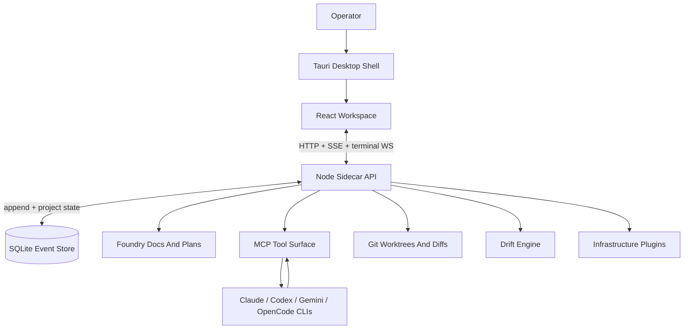

<div align="center">


# Symphony AI

**A local AI software foundry for planning, launching, supervising, and reviewing coding-agent teams.**

Symphony combines a planning Foundry, FORme operator cockpit, WITHme code cockpit, local sidecar API, MCP tools, git-aware task workflows, drift checks, release notes, and infrastructure plugins into one desktop workspace.

[](https://nodejs.org/)
[](https://tauri.app/)
[](https://sqlite.org/)
[](https://modelcontextprotocol.io/)
[](CHANGELOG.md)

<br/>


<sub><i>FORme cockpit captured from the current app. Run <code>npm run screenshots</code> from the repo root to regenerate the gallery.</i></sub>

</div>

---

## What Symphony Does

Symphony is a local-first desktop app for software work with AI teammates:

- **Foundry** turns project discovery into product briefs, technical specs, roadmaps, and task breakdowns.
- **FORme cockpit** gives the operator a high-level team view: who is live, what is in progress, what needs review, and whether the work is drifting.
- **WITHme cockpit** gives developers a code-first workspace with file tree, editor, agent context, bottom panels, terminal, changes, problems, output, and validations.
- **Agent teams** launch local provider CLIs such as Claude, Codex, Gemini, and OpenCode behind one audited tool layer.
- **Tasks and reviews** keep work tied to owners, status changes, validation runs, real git diffs, review decisions, and human approval gates.
- **Drift monitoring** checks whether work is staying aligned with task scope, lifecycle rules, reviews, tests, and project expectations.
- **GitHub releases** are shipped from tags, with release notes backed by [`CHANGELOG.md`](CHANGELOG.md) and process notes in [`RELEASE.md`](RELEASE.md).

The important distinction: Symphony is not just a chat box or a process launcher. It is a local operating layer for planning software, assigning work, watching agents act, and deciding what lands.

---

## Screenshots

| FORme cockpit | WITHme code cockpit |
| --- | --- |
|  |  |

| Menus | Settings |
| --- | --- |
|  |  |

More current captures live in [`docs/SCREENSHOTS.md`](docs/SCREENSHOTS.md).

---

## Architecture



SQLite at `<project>/.toad/toad.db` is the durable source of truth. The desktop shell, React UI, sidecar API, CLI agents, MCP server, and plugin tools are adapters around that evented core.

Agent and UI actions flow through [`LocalToolFacade`](src/tools/localToolFacade.js), which centralizes idempotency, role authority, task gates, risk policy, approvals, and audit logging.

---

## Quickstart

```bash
git clone https://github.com/TheOverAchievingDev/T.O.A.D.git symphony-ai
cd symphony-ai
npm install
npm --prefix ui install
npm --prefix ui run tauri:dev
```

Web-mode development is also supported:

```bash
# Terminal 1
npm run api:dev

# Terminal 2
npm --prefix ui run dev
```

The desktop app is the intended experience because it can select project folders and restart the sidecar against the selected repository.

---

## Repository Layout

```text
symphony-ai/
|-- .github/workflows/       GitHub release publishing
|-- CHANGELOG.md             Release history and proof of change
|-- PROJECT.md               Local project/agent operating notes
|-- README.md                Product overview
|-- RELEASE.md               Release checklist
|-- demo/                    Demo assets and scripted demo captures
|-- docs/                    Architecture, specs, screenshots, notes
|-- notes/                   Design and implementation notes
|-- package.json             Root engine scripts and dependencies
|-- scripts/                 Dev API server, release helpers, screenshots
|-- src/                     Local runtime, MCP, tools, git, drift, plugins
|-- test/                    Node test suites
`-- ui/                      React + Vite + Tauri desktop workspace
```

The old `toad-local/` wrapper layout has been retired from the release repo. Some internal `TOAD_*` environment variables and class names remain temporarily for compatibility while public naming continues moving to Symphony AI.

---

## Key Paths

```text
src/app/             Runtime composition
src/tools/           Shared tool facade for UI and agents
src/transport/       HTTP API, SSE, and terminal WebSocket support
src/mcp/             Agent-facing MCP server
src/task/            Task board, worktrees, diffs, reviews, merge gates
src/ide/             Code editor file, diff, diagnostics, and status tools
src/runtime/         CLI process supervision and event ingestion
src/foundry/         Planning sessions and generated project artifacts
src/drift/           Drift engine, deterministic checks, correction tasks
src/plugins/         Railway, EAS, Vercel, and plugin job/resource system
src/settings/        Global and project settings
src/github/          GitHub auth, repository, branch, and PR helpers
ui/src/components/   Desktop workspace screens and cockpit surfaces
ui/src-tauri/        Tauri shell, updater, and project-folder integration
```

---

## Local Data

| Surface | Default location |
| --- | --- |
| Project database | `<project>/.toad/toad.db` |
| Project settings | `<project>/.toad/settings.json` |
| Risk policy | `<project>/.toad/risk-policy.json` |
| Global settings | `%APPDATA%/toad/settings.json` on Windows, `~/.config/toad/settings.json` on Unix |
| Foundry sessions | `~/.symphony/foundry.db` unless overridden |

Important environment variables:

| Variable | Purpose |
| --- | --- |
| `TOAD_DB_PATH` | Override the SQLite database path |
| `TOAD_API_PORT` | Sidecar API port, defaults to `3001` |
| `TOAD_API_TOKEN` | Bearer token for `/api/call`, `/events`, and `/terminal` |
| `TOAD_API_ALLOWED_ORIGINS` | CORS allowlist for browser development |
| `TOAD_FOUNDRY_DB_PATH` / `SYMPHONY_FOUNDRY_DB_PATH` | Override Foundry session storage |
| `TOAD_GITHUB_CLIENT_ID` | GitHub Device Flow client id |
| `VITE_TOAD_API_BASE_URL` | UI API base URL |
| `VITE_TOAD_API_TOKEN` | UI bearer token |

---

## Verification

```bash
npm test
npm run ui:typecheck
npm run ui:build
npm run screenshots
```

Screenshot regeneration creates an isolated demo workspace under `.toad/screenshot-workspace`, starts temporary local API/UI servers, captures Chromium PNGs into `docs/screenshots/`, and stops the servers afterward.

---

## Release Flow

1. Update [`CHANGELOG.md`](CHANGELOG.md) under `Unreleased`.
2. Run the relevant verification commands.
3. Commit the release prep.
4. Tag with `vX.Y.Z`.
5. Push `main` and the tag.
6. Confirm the GitHub release workflow publishes the desktop artifacts.

See [`RELEASE.md`](RELEASE.md) for the full checklist.

---

## Current Status

Symphony is in an active local-first release line. The v0.1.4 release moved the product source to the repository root, restored GitHub release packaging from that layout, and fixed WITHme diffs for repositories without `HEAD`.

Near-term work is focused on branding cleanup, installer polish, richer WITHme code workflows, infrastructure plugin completion, Foundry output quality, drift grouping, and smoother first-run setup.

---

<div align="center">

<sub>Built with [React](https://react.dev/) . [Tauri 2](https://tauri.app/) . [SQLite](https://sqlite.org/) . [Node.js](https://nodejs.org/) . [MCP](https://modelcontextprotocol.io/)</sub>

</div>
