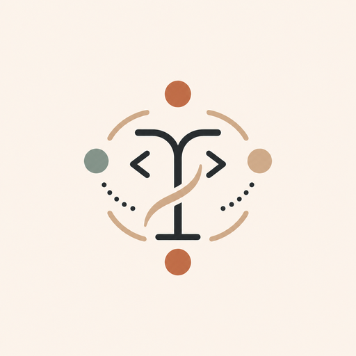
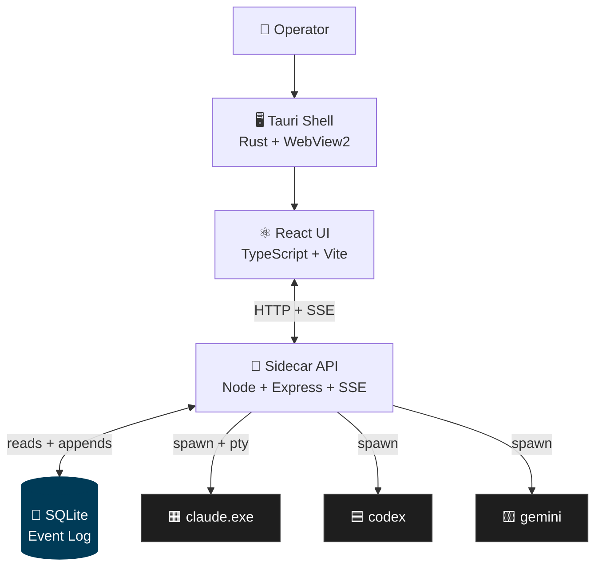
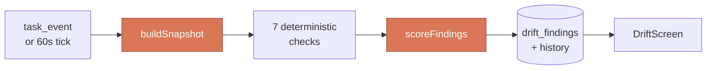
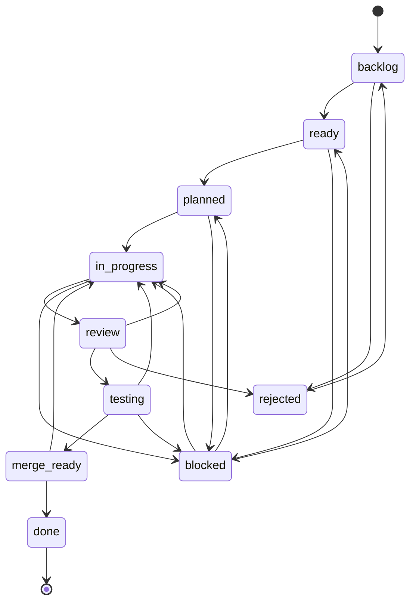

<div align="center">



# Symphony AI

**A local-first multi-agent CLI orchestrator for real coding work.**

Real CLI agents — Anthropic Claude, OpenAI Codex, Google Gemini — coordinated into structured teams that survive bad behavior, ship real diffs, and never leave your machine.

[](https://nodejs.org/)
[](https://tauri.app/)
[](https://sqlite.org/)
[]()
[]()
[]()

<br/>


<sub><i>Hero shot — multi-agent team in flight. Run <code>npm run screenshots</code> to regenerate from your local app.</i></sub>

</div>

---

## The 30-second pitch

- 🎼 **Real CLI agents, not chatbot pretenders.** Symphony AI spawns and coordinates the actual `claude`, `codex`, and `gemini` CLI binaries, captures their tool calls and diffs, and gates risky operations through a real human-approval workflow.
- 🗄️ **Local-first.** SQLite event log on disk is the source of truth. CLI processes are an adapter; the UI is a projection. No cloud control plane, no shared SaaS, your code never leaves your machine.
- 🛡️ **Built to survive bad agent behavior.** Risk-classified file rules, role authority, per-task git worktrees, drift monitoring, stuck-runtime detection, side-effect logging — every gate exists because some agent, somewhere, did the wrong thing.

---

## What it does

<table>
<tr>
<td width="50%" valign="top">

### 👥 Multi-agent teams

A **lead** agent decomposes work into tasks and delegates to specialists (developer, reviewer, researcher, architect). The orchestrator pins each agent to a task, captures their tool calls in real time, and surfaces the activity stream in the UI.


</td>
<td width="50%" valign="top">

### 📊 Drift Monitor

Seven deterministic checks score the team's drift from spec — illegal lifecycle transitions, out-of-scope file changes, missing test artifacts, role-permission denials, rubber-stamped reviews, provider-logic leakage, "done" tasks without merge evidence. Color-coded per task and aggregated team-wide.


</td>
</tr>
<tr>
<td width="50%" valign="top">

### 📋 Foundry (kiro-style spec docs)

Before a team launches, Foundry captures the project's product brief, tech spec, architecture, steering rules, design decisions (ADRs), definition of done, and roadmap. The lead agent reads these at boot — no more "what is this project even" thrashing.


</td>
<td width="50%" valign="top">

### ✅ Risk-classified human approvals

The §14 risk classifier auto-elevates tasks that touch sensitive paths (`.env`, `secrets/`, `package.json`) or run destructive commands. The orchestrator blocks `merge_ready → done` until a human signs off in the Approvals drawer. Every rule is editable in the UI with a live preview.


</td>
</tr>
<tr>
<td width="50%" valign="top">

### 🌳 Per-task git worktrees

Every task gets its own `git worktree` so agents work in isolation without stepping on each other or your editor. Diff capture uses real `git diff baseRef..HEAD` — not agent-reported file lists. The §19 merge integrator advances the base branch non-destructively (`merge-tree --write-tree` + `commit-tree` + `update-ref`) — never touches HEAD or your working directory.

</td>
<td width="50%" valign="top">

### 📈 Plan & quota usage

Live signed-in status and remaining plan quota for each subscription provider. Anthropic's `/usage` panel is scraped via a pty probe; Codex and Gemini show sign-in state from their auth files. Rendered in Settings → Providers and inside the new-team modal so you can see headroom before assigning roles.


</td>
</tr>
</table>

---

## Architecture

<div align="center">



</div>

**Durable events, transient processes.** SQLite at `<project>/.toad/toad.db` is the source of truth. Every meaningful state change — task created, status moved, plan proposed, review decided, runtime launched, tool invoked, approval requested — is an event row. CLI processes are an adapter; the UI is a projection. Killing both leaves the system in a known state. Restart, re-attach, replay.

**Layered tool surface.** Agents call MCP tools (`task_comment`, `review_request`, `task_human_approve`, `validation_run`, `drift_run`, …) which dispatch through [`LocalToolFacade`](toad-local/src/tools/localToolFacade.js). The same facade backs the HTTP `/api/call` endpoint the UI uses, so there is exactly one authority point for permission checks, idempotency, role authority, and the risk-policy gate. There is no separate UI API layer.

**Roles and authority.** Each agent carries a role (`lead`, `architect`, `developer`, `reviewer`, `tester`, plus `human` for operators). The [role-authority module](toad-local/src/security/roleAuthority.js) gates which tools each role can call. Read-only tools are common; mutations are scoped narrowly. Lead and human have full access; everyone else is on an explicit allowlist.

### The drift engine pipeline

<div align="center">



</div>

Each check is a pure function `({snapshot}) => DriftFinding[]` in `src/drift/checks/`. New checks (and the slice-2 LLM-semantic tier) drop in alongside without touching the engine.

### Task lifecycle state machine

<div align="center">



</div>

Defined deterministically in [`src/task/taskLifecycle.js`](toad-local/src/task/taskLifecycle.js) — every transition the orchestrator allows is enumerated, role-guarded, and replayable. The drift engine's `checkInvalidTransitions` flags any historical move outside this graph.

---

## Quickstart

```bash
# 1. Clone & install
git clone <this-repo> Project-TOAD
cd Project-TOAD/toad-local
npm install
cd ui && npm install && cd ..

# 2. Run the desktop app (one icon, one window)
cd ui
npm run tauri:dev

# 3. ...or run web-mode (two terminals)
# terminal 1: API at http://127.0.0.1:3001
npm run api:dev
# terminal 2: UI at http://localhost:5173
cd ui && npm run dev
```

On first launch, click **+** in the titlebar to create a team, or open **Foundry** to draft project specs first. The lead agent picks them up automatically once you launch.

> **Demo recording placeholder.** A full walkthrough GIF will live at `docs/screenshots/demo.gif` once recorded.

---

## Repo layout

```
Project-TOAD/
├─ README.md                              ← you are here
├─ HANDOFF-NEXT-AGENT.md                  rolling handoff doc — what was just done, what's next
├─ start-dev.bat                          boots backend + UI together
└─ toad-local/                            the actual codebase (TOAD = Symphony AI's engine codename)
   ├─ src/
   │  ├─ app/LocalToadRuntime.js          composes everything
   │  ├─ broker/                          durable message broker (SQLite)
   │  ├─ task/                            task board + worktree manager + merge integrator
   │  ├─ runtime/                         supervisor, registry, event log, ingestor
   │  ├─ tools/localToolFacade.js         the MCP/HTTP tool surface
   │  ├─ mcp/stdioServer.js               MCP server agents talk to
   │  ├─ transport/apiServer.js           HTTP + SSE bridge for the UI
   │  ├─ policy/                          §14 risk classifier + risk-policy store
   │  ├─ security/                        role authority gates
   │  ├─ settings/                        §3 two-tier settings store
   │  ├─ github/                          §3c GitHub Device Flow + PAT auth + REST client
   │  ├─ providers/                       §3c.2 plan-auth helpers + claude /usage probe
   │  ├─ foundry/                         kiro-style spec docs (architecture, steering, DoD, ADRs)
   │  ├─ drift/                           drift monitor (engine, checks, store, monitor)
   │  └─ diagnostics/                     §13 stuck-runtime detector + diagnostic checks
   ├─ test/                               600+ tests, pure node:test
   ├─ ui/                                 React 18 + TypeScript + Vite + Tauri 2 desktop UI
   ├─ scripts/
   │  ├─ dev-api-server.mjs               sidecar entry point
   │  └─ capture-screenshots.mjs          Playwright UI screenshot regen
   └─ docs/
      ├─ AGENT_TEAMS_HARDENING_CHECKLIST.md   the §-numbered spec
      ├─ ARCHITECTURE.md
      ├─ CHECKLIST_GAP_MATRIX.md              which §s are real vs partial vs todo
      ├─ screenshots/                         (see docs/screenshots/README.md to regen)
      └─ superpowers/specs/                   per-feature design docs (drift, etc.)
```

---

## The §-numbered hardening checklist

The checklist is the contract for "what does it mean for Symphony AI to be production-ish". Current state mirrored in [`CHECKLIST_GAP_MATRIX.md`](toad-local/docs/CHECKLIST_GAP_MATRIX.md). Highlights:

| § | Topic | Status |
|---|---|---|
| 1  | Task schema (priority/role/files/acceptance/risk/deps) | **Real** |
| 8  | Worktree per task with explicit `baseRef`/`baseBranch` | **Real** |
| 10 | Task dependency enforcement (ready ← deps done) | **Real** |
| 11 | Runtime instances pin `task_id` from `agent_launch` | **Real** |
| 13 | Stuck-runtime detector (silent past threshold) | **Real** |
| 14 | Risk-policy classifier + human-approval gate | **Real** + UI editor |
| 17 | Review feedback severity (nit/minor/major/blocking) | **Real** |
| 19 | Non-destructive merge integrator | **Real** |
| 20 | `task_history_export` joins task + runtime events | **Real** |
| 3  | Two-tier settings store + UI editors | **Real** |
| 3c | GitHub Device Flow + PAT auth | **Real** |
| 3c.2 | Provider plan-auth (Anthropic + Codex + Gemini wired) | **Real** |
| 3d | Risk-policy editor with live preview | **Real** |
| — | Foundry kiro-style spec docs (steering, ADRs, DoD) | **Real** |
| — | Drift monitor (slice 1: deterministic engine + dashboard) | **Real** |

Run `npm test` from `toad-local/` to verify — at the time of this commit, **600+ tests pass, 0 fail across 60+ test files**, including 49 new drift tests.

---

## Settings storage

Two-tier, JSON files. Writers validate; UI re-validates on read.

| Tier | Path | What lives here |
|---|---|---|
| Global | `%APPDATA%\toad\settings.json` (Windows) / `~/.config/toad/settings.json` (Unix) | Provider keys, GitHub token, theme defaults |
| Project | `<projectCwd>/.toad/settings.json` | Project-specific overrides |
| Risk policy | `<projectCwd>/.toad/risk-policy.json` | §14 file + command rules |

Project values shallow-merge over global values per top-level section. Each section is one of: `general`, `providers`, `github`, `workspace`, `risk`, `mcp`, `notifications`, `advanced`. The merged result includes a `_sources` field telling the UI which file each section came from.

---

## Risk policy & §14 human-approval gate

When an agent calls `review_request`, the orchestrator runs the [risk classifier](toad-local/src/policy/riskClassifier.js) against:

1. The files in the task's diff (matched against `rules` glob patterns).
2. The bash commands from the task's `runtime_events` stream (matched against `commandRules` substring/prefix patterns).

If a rule fires, the task's `riskLevel` may be auto-elevated and `requiresHumanApproval` may be set to `true`. The task is then blocked from `merge_ready → done` until a human (or the lead role) calls `task_human_approve`.

Edit the policy in **Settings → Risk policies** — paste sample files / commands in the live preview pane and see what the classifier would decide.

---

## GitHub auth

Two flows in [`src/github/githubAuth.js`](toad-local/src/github/githubAuth.js):

- **Device Flow (preferred).** Click "Sign in with GitHub" → modal shows a user code → enter it in the browser → authorize → the UI auto-polls until the token is granted. Requires `TOAD_GITHUB_CLIENT_ID`.
- **PAT fallback.** Paste a Personal Access Token, the orchestrator verifies via `/user`, captures user + scopes, persists. Works fully offline.

Tokens persist under `settings.github`. Click **Disconnect** any time to clear them (the OAuth client_id is preserved).

---

## Provider plan-auth

Each provider has its own subscription/plan auth managed by its CLI:

- **Anthropic** — `claude auth status --json` / interactive `/login` slash command. Plan-quota usage scraped via a pty probe of `/usage` and surfaced in **Settings → Providers**.
- **OpenAI Codex** — wired via filesystem detection of `~/.codex/auth.json`.
- **Gemini** — wired via filesystem detection of `~/.gemini/oauth_creds.json` and `~/.gemini/google_accounts.json`.
- **OpenCode** — API-only by design. The Providers tab hides the plan-auth toggle for it accordingly.

In **Settings → Providers**, switch a provider's "Auth method" segmented control to **Plan / subscription** to see the per-provider auth panel and live quota bars.

---

## Environment variables

| Variable | Purpose |
|---|---|
| `TOAD_DB_PATH` | Path to the SQLite file (default `<projectCwd>/.toad/toad.db`) |
| `TOAD_API_PORT` | API server port (default 3001) |
| `TOAD_API_TOKEN` | Bearer token required by `/api/call` and `/events` |
| `TOAD_API_ALLOWED_ORIGINS` | CORS origin allowlist for the SPA |
| `TOAD_UI_STATIC_DIR` | When set, ApiServer serves the built UI at `/` |
| `TOAD_GITHUB_CLIENT_ID` | OAuth client_id for the GitHub Device Flow |
| `TOAD_SETTINGS_PATH` | Override the global settings file path |
| `TOAD_SIDE_EFFECT_RETENTION_DAYS` | Side-effect log pruning window |
| `TOAD_USAGE_PROBE_DEBUG` | Verbose logging for the claude `/usage` pty probe |
| `VITE_TOAD_API_BASE_URL` | UI: API base URL (default `http://127.0.0.1:3001`) |
| `VITE_TOAD_API_TOKEN` | UI: bearer token sent with each request |

---

## Verification

```bash
# Backend — full suite, 600+ tests across 60+ files
cd toad-local
npm test

# UI — typecheck + production build
cd toad-local/ui
npm run typecheck
npm run build

# Regenerate README screenshots from the live app
cd toad-local
npm install --save-dev playwright   # one-time
npx playwright install chromium      # one-time
npm run screenshots                  # writes docs/screenshots/*.png
```

Tests use Node's built-in `node:test` runner — no Jest, Vitest, or other harness. Both `npm test` and `npm run build` should exit 0 on every commit.

---

## What's deferred

Tracked on the roadmap; flagged here so nothing is hidden:

- **Drift monitor slice 2.** LLM-semantic check tier (Haiku tier-1 always, Opus 4.7 / GPT-5 / Gemini 2.5 Pro tier-2 when score crosses the warning threshold), enrich `buildSnapshot` with `fileContents` so `checkProviderLogicLeakage` fires on real diffs, register `drift_run` in MCP tool definitions for non-UI callers. (Item 3 lift-`useDrift`-to-App and Item 2 taskBoard fan-out shipped in `ce86a07` + `56d8c4c`.)
- **Infrastructure plugin system.** Plugins for Railway / Vercel / Render / EAS / Supabase / etc. so agents can provision DBs, deploy previews, kick mobile builds, etc. — auth is CLI-mediated (same pattern as provider plan-auth), tools are MCP-exposed and risk-classified. Captured at `toad-local/docs/superpowers/specs/2026-05-04-infrastructure-plugin-system-idea.md`. Pursue after drift slice 2/3.
- **OpenCode plan-auth.** Not wired — OpenCode is API-only by design. The Providers tab hides the plan-auth toggle accordingly.
- **GUI launcher.** Standalone "Symphony AI launcher" that boots all servers + the app, shows server status, captures error reports — separate sub-project, brainstorming pending.
- **Demo recording.** A full walkthrough GIF for `docs/screenshots/demo.gif` — the screenshot pipeline handles stills today; motion captures land when convenient.
- **Tauri custom branding.** Real Symphony AI app icon (drop a 1024×1024 PNG over `toad-local/ui/src-tauri/toad-source.png` and run `npm run tauri:icon ../toad-source.png`).

The `HANDOFF-NEXT-AGENT.md` at the repo root tracks rolling state between sessions — read that first if you're picking up cold.

---

<div align="center">

<sub>

Symphony AI runs on the **TOAD orchestrator engine** (the project's internal codename, preserved in `toad-local/`).

Built with [React](https://react.dev/) · [Tauri 2](https://tauri.app/) · [SQLite](https://sqlite.org/) · [Node.js](https://nodejs.org/) · [MCP](https://modelcontextprotocol.io/) · disciplined TDD.

</sub>

</div>
