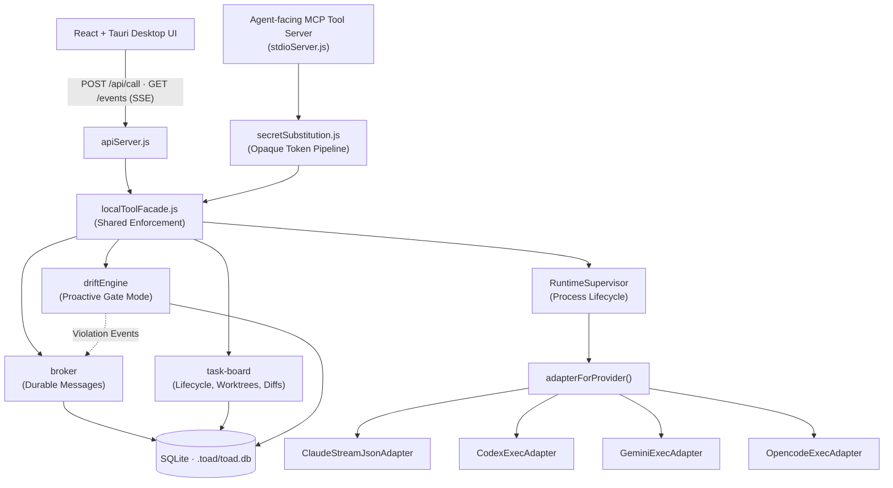
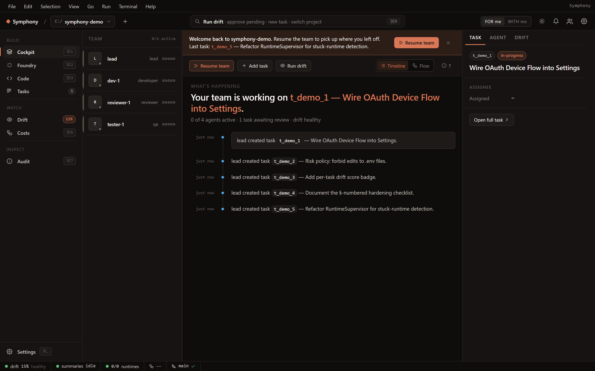
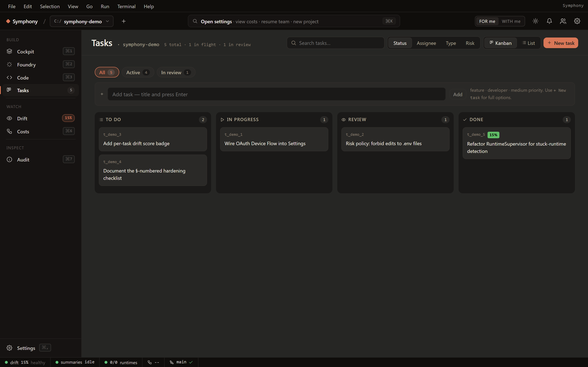
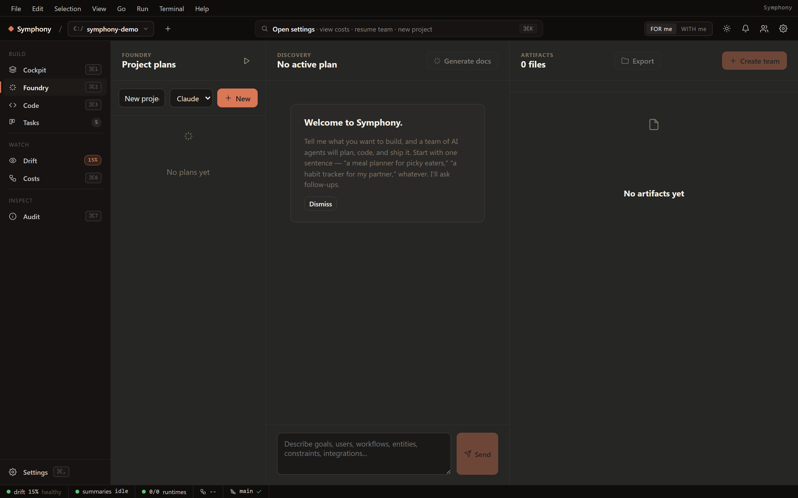
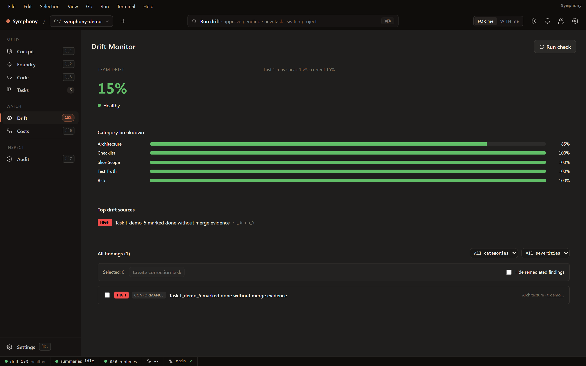
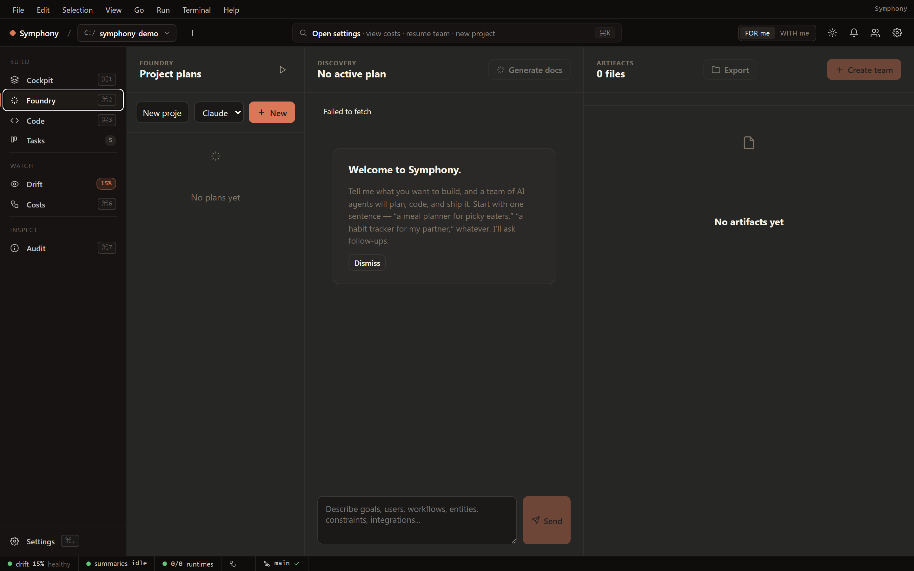
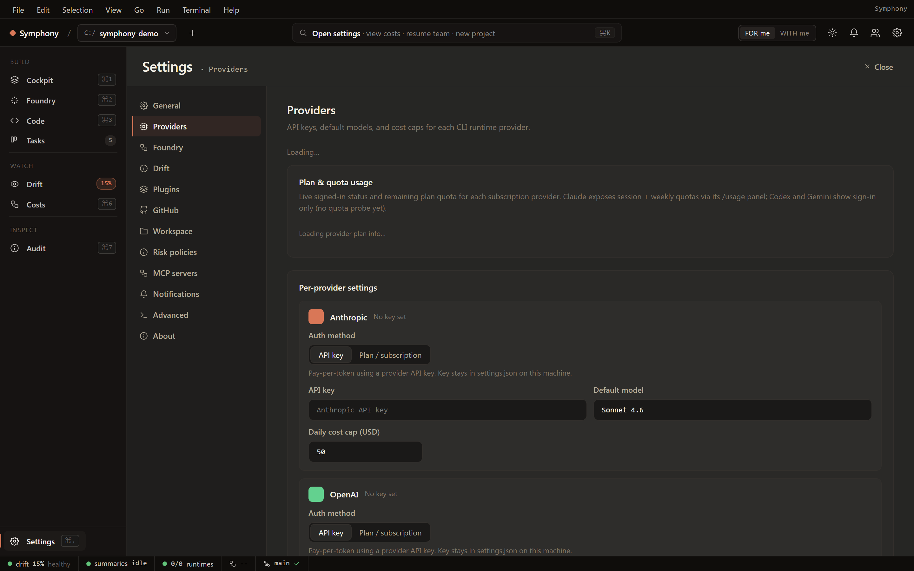

# Symphony Engine (TOAD)

This directory contains the local orchestration engine behind **Symphony AI** (formerly TOAD).

The product is now branded as Symphony AI. The `toad-local` directory name, `TOAD_*` environment variables, and several internal class names remain for compatibility while the project is renamed in stages.

## What Lives Here

- `src/app/LocalToadRuntime.js` composes the local runtime.
- `src/transport/apiServer.js` exposes the HTTP API and SSE event stream used by the UI.
- `src/mcp/stdioServer.js` exposes the agent-facing MCP tool server.
- `src/tools/localToolFacade.js` is the shared enforcement point for UI calls and agent tool calls.
- `src/tools/secretSubstitution.js` intercepts and redacts workspace secrets (Slice 2 opacity) before they reach the agent.
- `src/task/` owns tasks, lifecycle transitions, worktrees, diff capture, and merge gates.
- `src/runtime/` owns CLI process supervision and runtime event ingestion.
- `src/foundry/` owns Foundry planning sessions and generated project docs.
- `src/drift/` owns deterministic and semantic drift detection, pushing proactive `gate` violations to the broker.
- `src/plugins/` owns infrastructure plugin registration, auth, resources, jobs, and provider-specific tools.
- `ui/` contains the React + Tauri desktop workspace.

## Design Rules

- **Durable Event State:** The DB event ledger is the source of truth.
- **CLI Process State is Ephemeral:** Agent runtimes can be killed and resumed losslessly.
- **UI State is a Projection:** The React frontend maps event streams (like `task_history_export`) into rich visual states (e.g., Task Detail tabs).
- **Shared Enforcement:** Agent tools and human UI actions flow through the same facade.
- **Human-in-the-Loop:** Mutating commands require stable identity. Risky changes are controlled by policy and human approval gates.

## Architecture



## Provider Runtimes

Team agents run through a provider-keyed adapter seam (`adapterForProvider()`); every adapter implements the same `RuntimeAdapter` contract.

| Provider | Adapter | Lifecycle | Status |
| --- | --- | --- | --- |
| Anthropic (Claude) | `ClaudeStreamJsonAdapter` | persistent child | **Working** — whole-impl reviewed, full suite green |
| OpenAI (Codex) | `CodexExecAdapter` | session / per-turn (`codex exec [resume]`) | **Working** — SP1a Stage 1+2 reviewed |
| Google (Gemini) | `GeminiExecAdapter` | session / per-turn (`--session-id` / `--resume latest`) | **Grounded (gemini 0.42.0)** |
| OpenCode | `OpencodeExecAdapter` | session / per-turn (`run … --session <id>`) | **Grounded (opencode 1.15.4)** |

## Screenshots

Captured dynamically via our Playwright integration script (`npm run screenshots`). Full gallery available in **[docs/SCREENSHOTS.md](docs/SCREENSHOTS.md)**.

| Cockpit (Hero) | Tasks Board |
| --- | --- |
|  |  |

| Foundry Discovery | Drift Monitor |
| --- | --- |
|  |  |

| Team Creation | Settings |
| --- | --- |
|  |  |

## Local Development

Start the backend API:

```powershell
cd C:\path\to\symphony-ai\toad-local
npm.cmd run api:dev
```

Start the UI in a second terminal:

```powershell
cd C:\path\to\symphony-ai\toad-local\ui
npm.cmd run dev
```

For the full desktop shell:

```powershell
cd C:\path\to\symphony-ai\toad-local\ui
npm.cmd run tauri:dev
```

The default API port is `3001`; override with `TOAD_API_PORT`. By default, Symphony persists project state to `<projectCwd>/.toad/toad.db`. Override with `TOAD_DB_PATH`.

## Automated Screenshots

To regenerate the `docs/screenshots/` gallery after making UI changes, run:

```powershell
cd C:\path\to\symphony-ai\toad-local
npm.cmd run screenshots
```

*(Requires `playwright` devDependency).*
