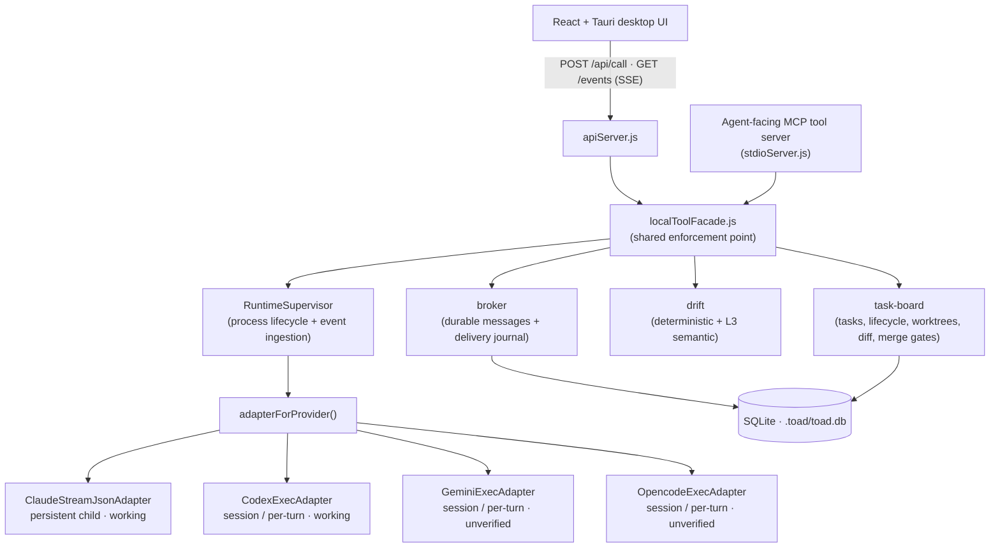

# Symphony Engine

This directory contains the local engine behind Symphony AI.

The product is now branded as **Symphony AI**. The `toad-local` directory name, `TOAD_*` environment variables, and several internal class names remain for compatibility while the project is renamed in stages.

## What Lives Here

- `src/app/LocalToadRuntime.js` composes the local runtime.
- `src/transport/apiServer.js` exposes the HTTP API and SSE event stream used by the UI.
- `src/mcp/stdioServer.js` exposes the agent-facing MCP tool server.
- `src/tools/localToolFacade.js` is the shared enforcement point for UI calls and agent tool calls.
- `src/task/` owns tasks, lifecycle transitions, worktrees, diff capture, and merge gates.
- `src/runtime/` owns CLI process supervision and runtime event ingestion.
- `src/foundry/` owns Foundry planning sessions and generated project docs.
- `src/drift/` owns deterministic and semantic drift detection.
- `src/plugins/` owns infrastructure plugin registration, auth, resources, jobs, and provider-specific tools.
- `ui/` contains the React + Tauri desktop workspace.

## Design Rules

- Durable event state is the source of truth.
- CLI process state is temporary.
- UI state is a projection.
- Agent tools and UI calls go through the same facade.
- Mutating commands require stable identity and idempotency.
- Risky changes are controlled by policy and human approval gates.

## Architecture



## Provider Runtimes

Team agents run through a provider-keyed adapter seam (`adapterForProvider()`);
every adapter implements the same `RuntimeAdapter` contract.

| Provider | Adapter | Lifecycle | Status |
| --- | --- | --- | --- |
| Anthropic (Claude) | `ClaudeStreamJsonAdapter` | persistent child | **Working** — whole-impl reviewed, full suite green |
| OpenAI (Codex) | `CodexExecAdapter` | session / per-turn (`codex exec [resume]`) | **Working** — SP1a Stage 1+2 reviewed, grounded against codex-cli 0.130 |
| Google (Gemini) | `GeminiExecAdapter` | session / per-turn | **Present, unverified** — structurally complete; CLI flags + event vocabulary not yet grounded against the real CLI |
| OpenCode | `OpencodeExecAdapter` | session / per-turn | **Present, unverified** — same as Gemini |

> Gemini and OpenCode are not production-trusted yet: their CLI invocation
> contracts and stream-JSON event shapes are unverified assumptions pending a
> grounding pass against the installed CLIs plus a scripted end-to-end proof,
> and there is no first-turn MCP-tool visibility probe across session adapters.
> Use Claude or Codex for real team runs until that grounding lands.

## Screenshots

Captured from the `family-meal-planner` demo scenario. Full gallery (34 views):
**[docs/SCREENSHOTS.md](docs/SCREENSHOTS.md)**.

| Cockpit (FOR me) | Tasks board |
| --- | --- |
|  |  |

| Foundry discovery | Drift monitor |
| --- | --- |
|  |  |

## Backend Verification

```powershell
cd C:\path\to\symphony-ai\toad-local
npm.cmd test
```

## UI Verification

```powershell
cd C:\path\to\symphony-ai\toad-local\ui
npm.cmd run typecheck
npm.cmd run build
```

## Local Development

Start the backend API:

```powershell
cd C:\path\to\symphony-ai\toad-local
npm.cmd run api:dev
```

Start the UI in a second terminal:

```powershell
cd C:\path\to\symphony-ai\toad-local\ui
npm.cmd run dev
```

For the full desktop shell:

```powershell
cd C:\path\to\symphony-ai\toad-local\ui
npm.cmd run tauri:dev
```

The default API port is `3001`; override with `TOAD_API_PORT`.

By default Symphony persists project state to `<projectCwd>/.toad/toad.db`. Override with `TOAD_DB_PATH`:

```powershell
$env:TOAD_DB_PATH='C:\path\to\toad.db'
$env:TOAD_DB_PATH=':memory:'
```

`.toad/` is git-ignored. Stop the runtime before deleting or backing up the SQLite file.

## API Token

Generate and persist a local API token:

```powershell
npm.cmd run token:generate
```

Or set it per shell:

```powershell
$env:TOAD_API_TOKEN='<your-secret>'
$env:VITE_TOAD_API_TOKEN='<your-secret>'
```

When set, `POST /api/call` and `GET /events` require the token.

## Claude Smoke

The live Claude smoke test depends on local Claude authentication:

```powershell
cd C:\path\to\symphony-ai\toad-local
$env:TOAD_CLAUDE_SMOKE='1'
npm.cmd run smoke:claude
```

If Claude is not authenticated, the smoke test reaches the CLI boundary and reports the auth or rate-limit status instead of proving a full live turn.
