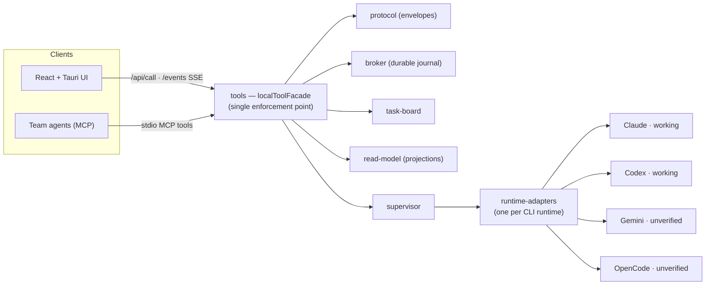

# Symphony Engine Architecture

> Historical note: the engine directory, `TOAD_*` env vars, and several
> internal class names retain the original "TOAD" naming during the staged
> rename to **Symphony AI**.

## Overview



Provider status as of this revision: Claude and Codex are whole-impl
reviewed and grounded; Gemini and OpenCode are structurally complete but
their CLI invocation contracts + stream-JSON event vocabularies are **not
yet grounded** against the real CLIs (tracked follow-up — see the bundle
whole-impl review doc under `docs/superpowers/`). The adapter seam is
provider-agnostic; un-grounded providers are wired but not production-trusted.

## Components

- `protocol`: message, task, runtime, delivery, approval, and command envelopes.
- `broker`: durable message and delivery journal APIs.
- `task-board`: task event stream and projections.
- `runtime-adapters`: one adapter per CLI runtime.
- `supervisor`: process lifecycle, restart policy, stale process cleanup, and liveness.
- `tools`: MCP or CLI command facade over the broker/task/runtime APIs.
- `read-model`: chat, inbox, board, approval, process, and audit projections.

## First Runtime Contract

```text
launch(input) -> launch result
stop(input) -> stop result
sendTurn(envelope) -> delivery receipt
events() -> async runtime event stream
approve(decision) -> approval answer
health(input) -> health report
```

The adapter translates between TOAD envelopes and a concrete CLI runtime. It does not own message state, task state, retries, or UI projection.

## First Broker Contract

```text
appendMessage(envelope, idempotencyKey)
listInbox(teamId, recipient)
markRead(messageId, reader)
beginDeliveryAttempt(messageId, runtimeId, destination)
commitDeliveryAttempt(attemptId, receipt)
failDeliveryAttempt(attemptId, error, retryable)
```

The broker is responsible for identity checks, idempotency, delivery journaling, and durable receipt state.

