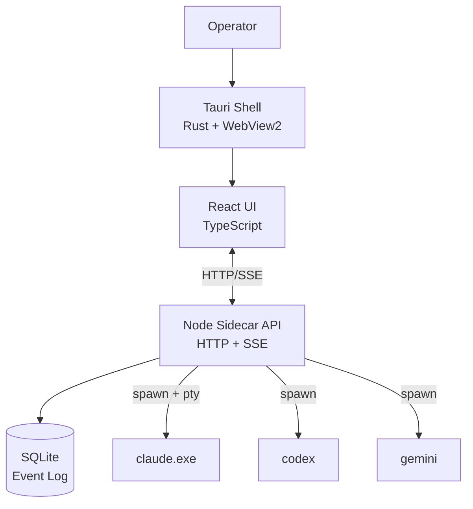
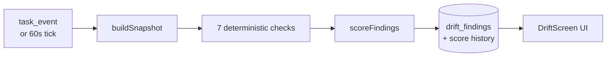

# Symphony AI README Refactor — Design

**Status:** approved (brainstorming session 2026-05-04)
**Author:** kaydenraquel + Claude

---

## 1. Problem

The repo's root `README.md` (387 lines) was written for the project's "TOAD"
identity and is plain-text technical documentation only. The UI was rebranded
to "Symphony AI" this session and the README hasn't caught up. We also want
the README to be visually rich (screenshots, diagrams, badges) so a drive-by
visitor on GitHub gets a real sense of what the project does, not a wall of
text.

The existing technical content is genuinely valuable (§-numbered hardening
checklist, environment variable reference, settings storage, risk policy,
GitHub auth, provider plan-auth) and must be preserved.

## 2. Scope

**In scope:**
- Refactor root `README.md`: add Symphony AI branding + product splash on top, preserve and lightly reorganize existing technical sections below
- Build a Playwright-based screenshot capture script (`scripts/capture-screenshots.mjs`) that reproducibly captures the major screens
- Add `docs/screenshots/` directory with regeneration instructions
- Add an `npm run screenshots` script that orchestrates the capture
- Embed Mermaid architecture diagrams that render natively on GitHub (no PNG dependency)

**Explicitly out of scope:**
- The GUI launcher (separate brainstorming round)
- Updating `toad-local/README.md` (sub-package readme — separate concern)
- Demo video / GIF capture (placeholder slot only; the user records when ready)
- A landing-page website (this is repo-level docs, not a marketing site)

## 3. Branding decision

**Symphony AI** is the canonical product name. **TOAD** is the legacy internal
codename / engine name (preserved in the repo slug `toad-local/` and in a
single footer mention: "Symphony AI runs on the TOAD orchestrator engine").

## 4. New README structure

Top-down sections:

1. **Hero block** — Banner SVG with "Symphony AI" wordmark + tagline; badge row
   (license, Node 20+, "TDD-discipline shipped"); hero screenshot
   (`docs/screenshots/workspace.png`); one-paragraph "what is this".
2. **30-second pitch** — three bullets:
   - "Real CLI agents, not chatbot pretenders"
   - "Local-first: SQLite event log, no cloud lock-in"
   - "Built to survive bad agent behavior"
3. **Features grid** — one block per major feature with screenshot:
   - Multi-agent teams (workspace + agent activity stream)
   - Drift Monitor (just-shipped slice 1)
   - Foundry kiro-style spec docs
   - Risk-classified human approvals
   - Per-task git worktrees
   - Plan/quota usage panel
4. **Architecture diagram** — Mermaid graph showing the Tauri shell → sidecar
   API → SQLite event log → CLI runtimes flow. Plus inset Mermaid diagrams for
   the drift engine pipeline and task lifecycle state machine.
5. **Quickstart** — three commands: clone, install, run.
6. **Demo GIF placeholder** — `` reference
   for a future screen-recorded walkthrough.
7. **Repo layout** — preserved from existing README, lightly refreshed.
8. **The §-numbered hardening checklist** — preserved verbatim.
9. **Architecture in five paragraphs** — preserved, lightly updated.
10. **Settings storage / Risk policy / GitHub auth / Provider plan-auth** —
    preserved.
11. **Environment variables** — preserved.
12. **Verification (npm test)** — preserved, append drift suite.
13. **What's deferred / roadmap** — preserved, append slice-2 drift items.
14. **Footer** — "Symphony AI runs on the TOAD orchestrator engine. License,
    contributions, etc."

## 5. Screenshot capture script

`scripts/capture-screenshots.mjs` — Playwright-based, headless Chromium.

Targets to capture (each at 1440×900):

| Screen | Selector / route | Notes |
|---|---|---|
| `workspace.png` | sidebar Workspace | Hero shot — full app |
| `drift-screen.png` | sidebar Drift | The slice-1 dashboard |
| `foundry.png` | sidebar Foundry | Kiro-style docs |
| `tasks.png` | sidebar Tasks | Kanban board with drift badges |
| `agent-inbox.png` | open an agent's inbox | Activity stream |
| `create-team-modal.png` | titlebar "+" button | Includes the plan-usage panel |
| `settings-providers.png` | settings → Providers | Plan-quota visible |
| `risk-approvals.png` | titlebar approvals icon | Risk-classified queue |
| `commands-palette.png` | Cmd+K / Ctrl+K | Power-user UI |

Approach:
- Boot the Vite dev server (`npm run dev` in `ui/`) in the background
- Wait for `localhost:5173` to respond
- Boot the sidecar API server (`npm run api:dev`) in the background
- Wait for `127.0.0.1:3001/health`
- Launch Playwright headless Chromium, set viewport to 1440×900
- Navigate, wait for known content, screenshot
- Tear down both servers cleanly on exit (or interrupt)

The script is best-effort — if a particular screen requires a team to exist
(e.g. drift screen, agent inbox), the script seeds a minimal test team via
the API before navigating.

Idempotent: re-runnable, overwrites stale PNGs in place. Safe to commit the
PNGs to git.

## 6. New / modified files

```
README.md                          MODIFIED — refactored
scripts/capture-screenshots.mjs    NEW — Playwright automation
docs/screenshots/.gitkeep          NEW — keeps dir present
docs/screenshots/README.md         NEW — ~10 lines, regeneration instructions
package.json                       MODIFIED — adds `screenshots` script + `playwright` devDependency
```

## 7. Mermaid diagrams to include

**System architecture (top-level):**


**Drift engine pipeline:**


**Task lifecycle state machine:** generated from `src/task/taskLifecycle.js`'s
`ALLOWED_TRANSITIONS` table.

## 8. Acceptance criteria

- README renders correctly on GitHub (Mermaid renders, badges resolve, no
  broken images for diagrams — screenshots can be empty until captured)
- `npm run screenshots` produces all 9 PNGs in `docs/screenshots/` without
  manual intervention
- Existing technical content is preserved (no §-section accidentally dropped
  in the refactor)
- Symphony AI branding consistent throughout the new top sections
- Footer correctly references TOAD as the engine name

## 9. Decisions log (from brainstorming)

- **Q1 (branding):** Symphony AI is the product; TOAD stays as the engine codename
- **Q2 (screenshots):** Option B — Playwright automation, reproducible
- **Q3 (scope):** Option B — refactor existing, preserve technical depth, marketing splash on top
